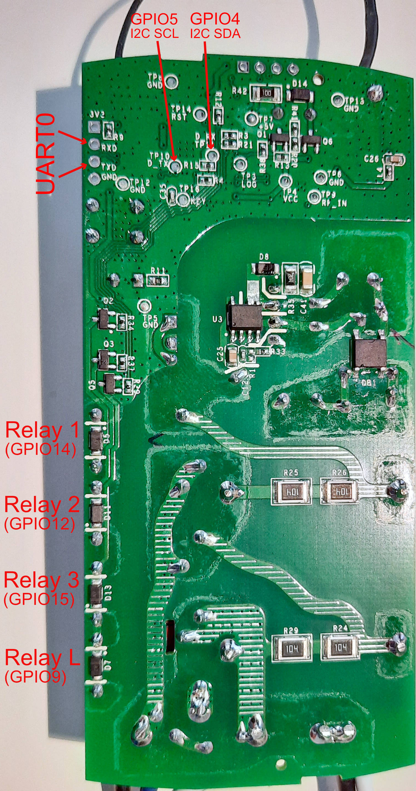
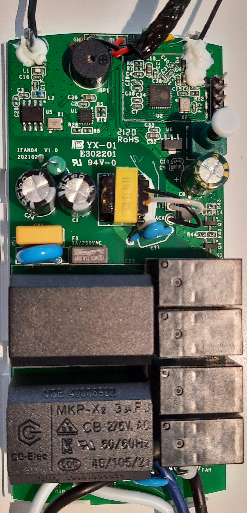
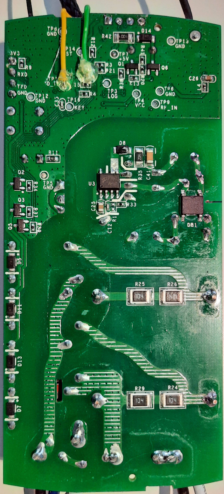

# esphome-ifan04
Sonoff IFAN04 with ESPHome

This configuration template enables the use of the Sonoff IFAN04 fan controller with ESPHome and Home Assistant.
In addition, with a few basic soldering skills 🙂, the I2C bus can also be used.

## Updates 2025-02-22

### New external components

Due to the fact that the "custom components" were removed from ESPHome (2025.2.0), I was (finally) forced to engage with the creation of external components. 🙂
Therefore, I have now implemented the RC receiver as its own external component `ifan_remote`, which is also stored in its own GitHub [repository] (https://github.com/rh1rich/esphome-ifan-remote).

On this occasion, I also implemented an idea I had been nurturing for a long time: The sound output of the buzzer should be easier to handle and also be usable for notifications from HA.
The idea was to develop a component that, similar to the `rtttl` component, outputs any beep sequence through a binary buzzer. The result was the `morse_code` component (GitHub [repository] (https://github.com/rh1rich/esphome-morse-code)), which is used in the new version of this IFAN04 template.

### Buzzer

Any button press produces now a short beep, if the buzzer is enabled.

The beep sounds, that are produced for the different actions, can be easily customized in the `buzzer_play` script.

With the new user-defined action `play_morse_code`, any text can be sent from Home Assistant and played as Morse code through the buzzer.

More information can be found below.

### Fan controller with 4 different speeds

I have created a second template (template_4_speeds.yaml) that allows you to use 4 different speeds with the fan controller. These 4 speeds are mapped to the relays as follows:

| Fan speed | used relays |
| --------- | ----------- |
| low | 1 |
| mid 1 | 2 |
| mid 2 | 1 + 2 |
| high | 3 |

In my standard IFAN04-H the two capacitors have nearly the same specs (2.5uF, 3uF). So the 4 speeds makes no sense, because speed 1 (low) and 2 (mid 1) would be equal.
But if you replace the capacitors for example with 1.8uF and 3.9uF, you would have 4 different speeds (1.8uF, 3.9uF, 5.7uF and full).

## Fan control and timing (template.yaml)

The three different speeds (low, mid, high) are controlled via the three fan relays and their associated capacitors as follows.

| Fan speed | used relays |
| --------- | ----------- |
| low | 1 |
| mid | 1 + 2 |
| high | 3 |

### Startup boost
If startup-boost is enabled and the fan is turned on, it always starts with high speed for the time configured via the substitution variable "fan_startup_boost_time". After this time the speed is changed to the selected one (low or mid speed).
If startup-boost is disabled, the fan speed is immmediatly set to the selected one (low, mid, high).

### Original timing sequence

The original firmware had the following special timing sequence on activating the different speeds.

| Fan speed | timing sequence |
| --------- | --------------- |
| low | relay 1 + 2 are turned on, after 5 seconds relay 2 is turned off |
| mid | relay 1 + 2 are turned on |
| high | relay 1 is turned on, after 5 seconds relay 3 is turned on and relay 1 is turned off |

## Configuration switches

- Light enabled - Activates the ability to switch the light relay via remote control
- Fan startup-boost enabled - Enables the startup-boost, if the fan is turned on
- Restart - Restart the iFan04
- Buzzer enabled

## Additional sensors

- RC button light - Binary sensor which is activated for 500ms, if the remote control button "Light" (top left) was pressed
- RC button RF/WiFi - Binary sensor which is activated for 500ms, if the remote control button "RF clearing" (bottom left) or "WiFi pairing" (bottom right) was pressed (shortly)
- RC button RF (long) - Binary sensor which is activated for 500ms, if the remote control button "RF clearing" (bottom left) was pressed for 5 seconds
- RC button WiFi (long) - Binary sensor which is activated for 500ms, if the remote control button "WiFi pairing" (bottom right) was pressed for 5 seconds
- Text sensor with WiFi informations (ip address, ssid, mac address, dns address)
- Temperature and humidity via SHT3x I2C sensor for demonstration (commented out in the yaml file)
- Text sensor with the esphome version
- Uptime and WiFi signal strength in dBm and percent

## RF remote control

RF remote control receiver sends the remote control commands via the serial interface UART0 to the ESP8266.

These commands consits of 8 bytes. The first two bytes are always `0xAA55` and the last byte is a checksum of the bytes 3 to 7, the command code.

To receive and use these commands in ESPHome the serial data is processed by the external component `ifan_remote`.
This component provides the command with 2 variables:
- command.high ... bytes 3 and 4
- command.low ... bytes 5, 6 and 7

| RC button | command.high | command.low | label |
| --------- | ------------ | ----------- | ----- |
| 1 (left-top) | 0104 | 000104 | Light on/off |
| 2 | 0106 | 000101 | Mute |
| 3 | 0104 | 000103 | High speed |
| 4 | 0104 | 000102 | Medium speed |
| 5 | 0104 | 000100 | Fan off |
| 6 | 0104 | 000101 | Low speed |
| 7 | 0101 | 000102 | RF clearing |
| 7 | 0107 | 000101 | RF clearing (long press of 5s) |
| 8 (right-bottom) | 0101 | 000102 | Wi-Fi pairing |
| 8 (right-bottom) | 0101 | 000101 | Wi-Fi pairing (long press of 5s) |

The two bottom buttons are sending the same command code to the ESP8266 when pressed less than 5 seconds.
If the RF clearing button is pressed 5s, the remote control is disconnected (cleared) from the receiver. After that the remote control must be reconnected to the receiver to be used anymore.

The external component is implemented in the configuration file as follows:

    external_components:
      - source:
          type: git
          url: https://github.com/rh1rich/esphome-ifan-remote

    logger:
      baud_rate: 0

    uart:
      rx_pin: GPIO03
      baud_rate: 9600
      id: uart_bus

    ifan_remote:
      on_command:
        then:
          - logger.log:
              format: "RC command '%04X:%06X' received."
              args: [ 'command.high','command.low' ]
          - if:
              condition:
                lambda: return (command.high == 0x0104 && command.low == 0x000100);
              then:
                - fan.turn_off: fan_comp
          - if:
              condition:
                lambda: return (command.high == 0x0104 && command.low == 0x000101);
              then:
                - fan.turn_on:
                    id: fan_comp
                    speed: 1
                    ...

To use the RF remote control the uart debugging MUST be disabled by setting `baud_rate: 0` in the logger-configuration!

### (Re)Connect a remote control to the IFAN04

To connect an remote control to the IFAN04 press any button within 5s after powering on the IFAN04. If this was successfull all buttons of this remote control should work, if not turn of the IFAN04 and repeat this operation.

The IFAN04 RF receiver can learn up to 10 remote controls. The 11th remote control will overwrite the first one, ...

## Buzzer

The beep sounds, that are produced for the different actions, can be easily customized in the `buzzer_play` script. The beep sequence produced is the `text` after `morse_code.start` converted to Morse code.

In the following example the Morse code for the letter 'T', a long beep (dah), is played, if the fan is turned off.

    external_components:
      - source:
          type: git
          url: https://github.com/rh1rich/esphome-morse-code

    morse_code:
      output: buzzer
      dit_duration: 50

    script:
      - id: buzzer_play
        mode: restart
        parameters:
          action: string
        then:
          - if:
              condition:
                lambda: return id(buzzer_enabled).state && (action == "fan_off");
              then:
                - morse_code.start:
                    text: "T"    # -

With the user-defined action `play_morse_code`, any text can be sent from Home Assistant to IFAN04 and played as Morse code through the buzzer.

    api:
      actions:
        - action: play_morse_code
          variables:
            text_string: string
          then:
            - morse_code.start:
                text: !lambda 'return text_string;'

More details about the morse_code component can be found in the [Github repository] (https://github.com/rh1rich/esphome-morse-code).

## IFAN04 hardware and GPIO assignments

IFAN04 has a ESP8266 with 1 MB flash.

The RF remote control receiver communicates with the ESP8266 via the UART0 serial interface. Baudrate is 9600.

The fan and light is controlled with four relays.

To use the I2C interface of the ESP8266 the SDA and SCL pins can be accessed through the test pins (TP10, TP11) on the backside of the PCB.

| ESP pin | assignment | comments |
| ------- | ---------- | -------- |
| GPIO0 | Button | |
| GPIO1 | UART0 TX | |
| GPIO3 | UART0 RX | RF remote control receiver |
| GPIO4 | I2C SDA | TP11 D_RX on the PCB backside |
| GPIO5 | I2C SCL | TP10 D_TX on the PCB backside |
| GPIO9 | Light relay | D7 on the PCB backside |
| GPIO10 | Buzzer | |
| GPIO12 | Fan relay 2 | D11 on the PCB backside, 3 uF on IFAN04-H |
| GPIO13 | LED | |
| GPIO14 | Fan relay 1 | D5 on the PCB backside, 2.5 uF on IFAN04-H |
| GPIO15 | Fan relay 3 | D13 on the PCB backside, no cap |

### Front- and backside of the IFAN04-H with connected cables for the I2C interface

